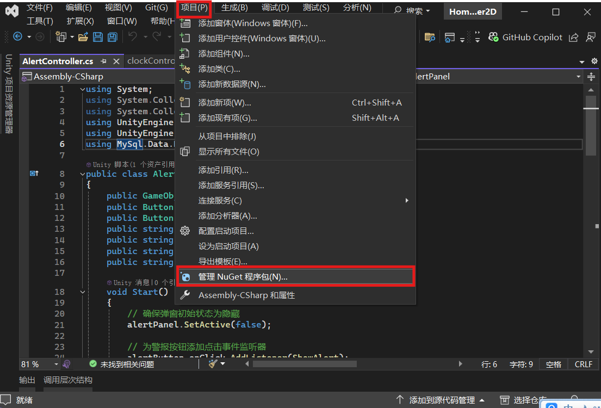
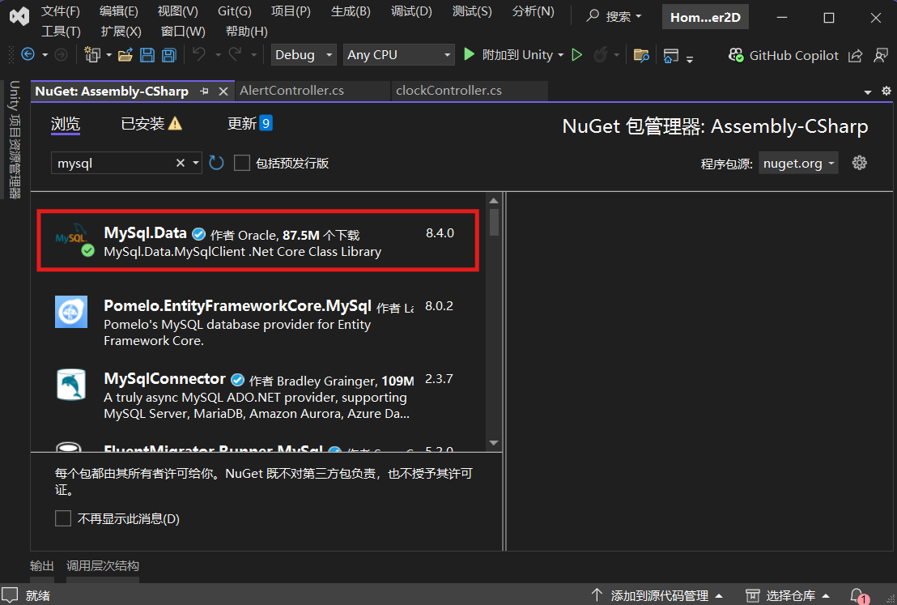
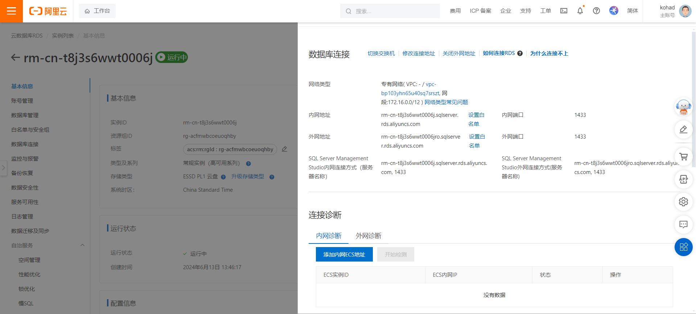
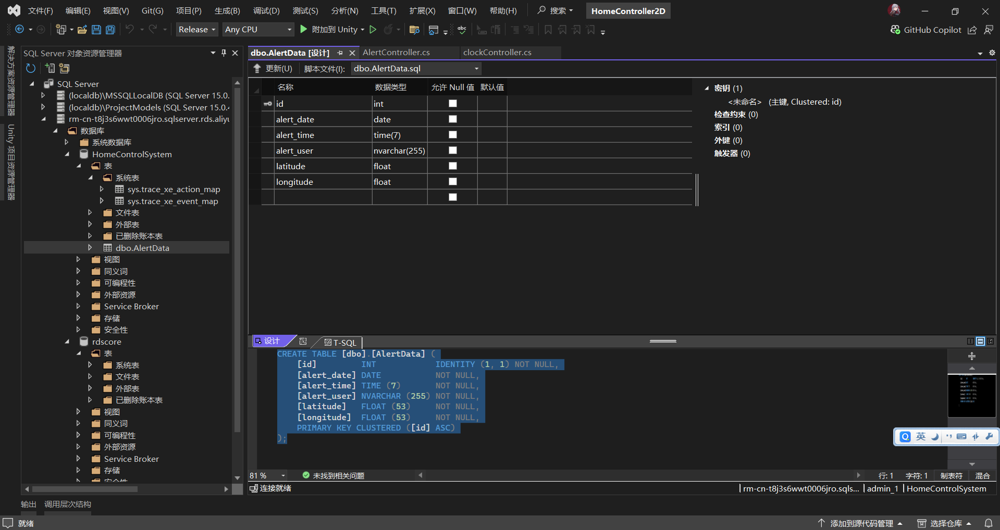
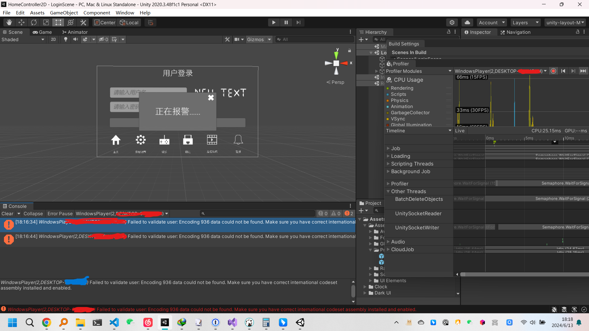

# 智能家庭中控

## Unity项目缺少Mysql驱动

### 解决方案

在VS中找到项目->NuGet管理包->安装MySQL官方包

方案弃用，改用SQL Server
为了方便测试,避免其他成员再安装数据库驱动等,使用了云数据库

报警并存储数据到数据库功能实现

DEBUG

居然是因为GB2312的问题导致无法连接数据库,这很难评

解决：

[[Exception]NotSupportedException: Encoding 936 data could not be found. Make sure you have correct international codeset assembly installed and enabled.
System.Text.Encoding.GetEncoding... ](https://www.bilibili.com/read/cv26870271/)